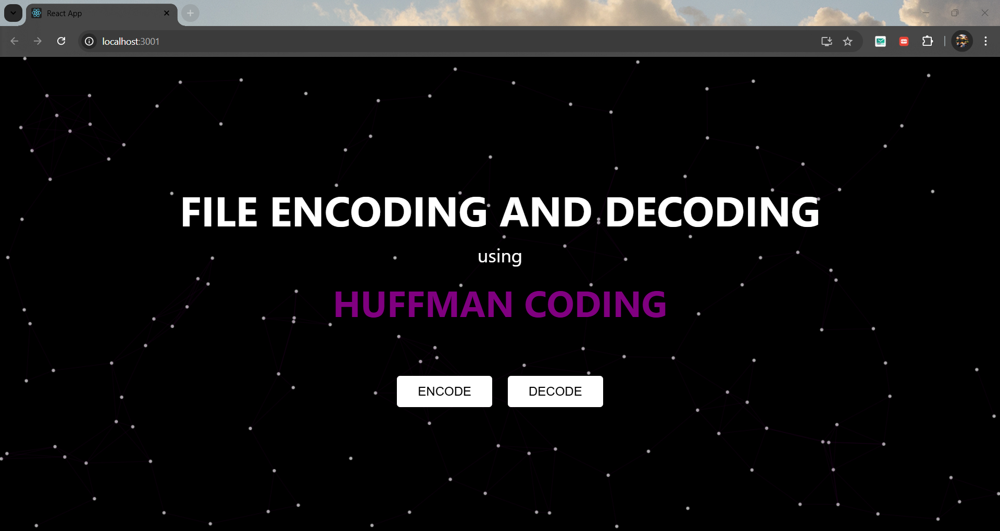
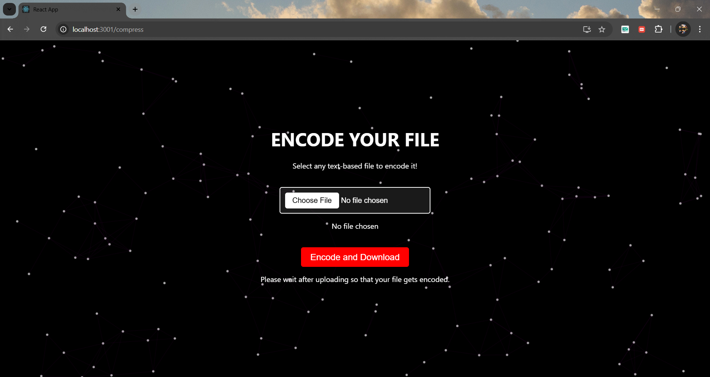
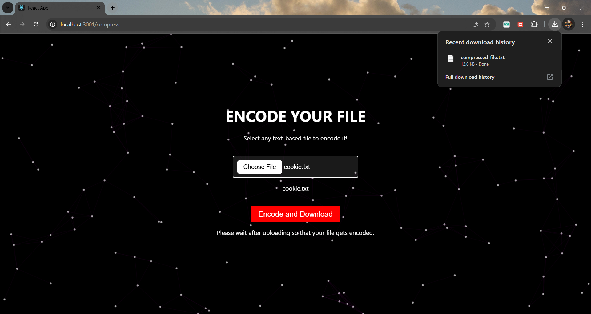
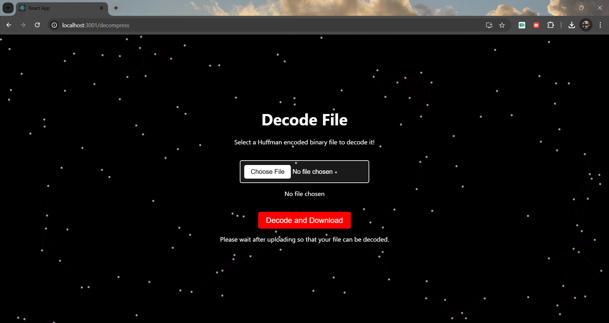
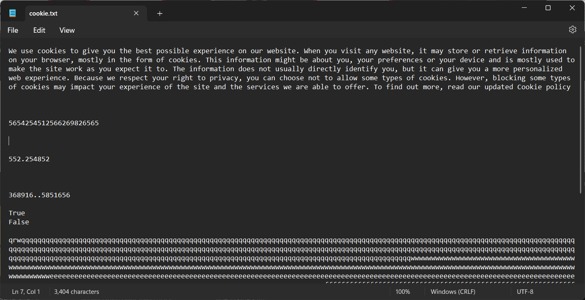
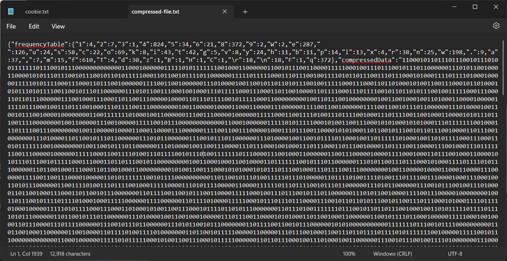

# Huffman Encoding Project

This is a full-stack project that implements Huffman Encoding and Decoding algorithms for text files using the MERN stack (MongoDB, Express, React, and Node.js).

---

## 📂 Project Structure

The project consists of two main parts:

1. **Backend** (`huffman-backend`):  
   - Implements the server-side logic for encoding and decoding text files using Huffman algorithms.
   - Built using Node.js, Express, and MongoDB.

2. **Frontend** (`huffman-frontend`):  
   - Provides a user-friendly interface to upload files for encoding and decoding.
   - Built with React.js.

---

## 🚀 Features

- **Encoding:** Upload a text file and encode its content using the Huffman algorithm.
- **Decoding:** Upload an encoded file to decode it back to its original content.
- **Real-Time Interaction:** Smooth and interactive user interface.
- **Persistent Storage:** Data storage using MongoDB for better performance and scalability.

---

## 🛠️ Technologies Used

### Frontend:
- React.js
- HTML/CSS
- JavaScript

### Backend:
- Node.js
- Express.js
- MongoDB

---

## 📸 Screenshots

### 1. **Homepage**



### 2. **Encoding Page**
 



### 3. **Decoding Page**



---

## 📄 Example Data and Encoded Output

### Input Data (Inside the Uploaded Text File)
The original text file contains the following data:  

This is a sample text to demonstrate Huffman encoding of text files. 



```

### Encoded Output (Inside the Downloaded File)
After encoding, the file contains the following binary representation:  
```



```

### Decoded Output
After decoding the binary file, the original text is restored:  
```
This is a sample text to demonstrate Huffman encoding of text files.
```

### Encoding and Decoding Process
- **Encoding**: Converts characters in the input text to a unique binary representation based on frequency.
- **Decoding**: Reconstructs the original text from the binary data using the Huffman decoding tree.

---

## ⚙️ Installation and Setup

### Prerequisites:
- Node.js installed on your machine.
- MongoDB installed and running locally or a MongoDB Atlas account.

### Steps to Run the Project:

1. **Clone the Repository**
   ```bash
   git clone <repository-url>
   cd huffman_coding
   ```

2. **Setup Backend**
   ```bash
   cd huffman-backend
   npm install
   # Create a `.env` file in the `huffman-backend` directory with the following variables:
   # MONGO_URI=<Your MongoDB Connection String>
   # PORT=5000
   npm start
   ```

3. **Setup Frontend**
   ```bash
   cd ../huffman-frontend
   npm install
   npm start
   ```

4. **Run the Application**
   - Open your browser and navigate to `http://localhost:3000`.

---

## 🛡️ Environment Variables

Make sure to configure the following environment variables:

### Backend:
- `MONGO_URI`: MongoDB connection string.
- `PORT`: Port number for the server.

---

## 📂 File Structure

### Backend:
```
huffman-backend/
├── config/          # Configuration files (e.g., MongoDB connection)
├── controllers/     # Business logic for routes
├── models/          # Mongoose models
├── routes/          # API endpoints
├── utils/           # Helper functions
├── uploads/         # Uploaded files
├── server.js        # Entry point
```

### Frontend:
```
huffman-frontend/
├── public/          # Public assets (e.g., images, favicon)
├── src/
    ├── components/  # Reusable components
    ├── styles/      # CSS styles
    ├── App.js       # Main component
    ├── index.js     # React entry point
```

---

## ✨ Future Enhancements

- Add user authentication for secure access.
- Implement advanced visualization for the encoding and decoding processes.
- Enable file upload/download from cloud storage.

---

## 🤝 Contributing

Contributions are welcome! Feel free to fork the repository and submit a pull request.

---

## 📄 License

This project is licensed under the MIT License.

---

